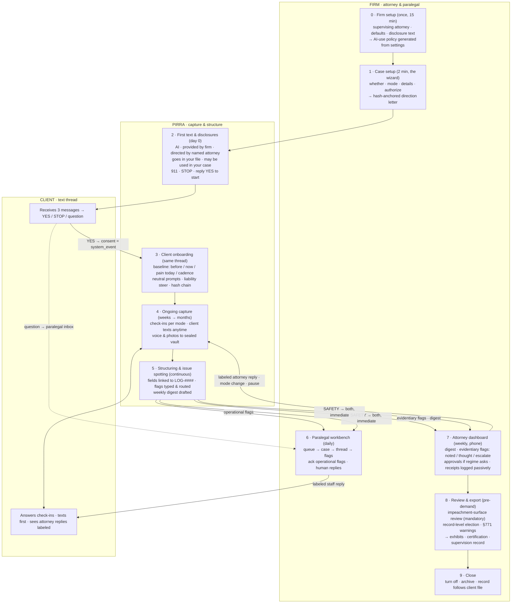

# PIRRA case flow

*From the first text to the exhibit, one case start to finish. Rendered version with the
swimlane figure, the sample first-text thread and the flag table:
[`case-flow.html`](case-flow.html). Working doc, synthetic examples, September 2026.*

Three lanes. The **client** only ever sees a text thread. **PIRRA** captures, structures and
spots issues. The **firm** directs, supervises and exports. Lanes 1 and 2 write to the evidence
plane; everything the firm does on top is the intelligence plane.

## Stages

| # | Stage | Who · how long | Gate / output |
|---|---|---|---|
| 0 | Firm setup | Attorney · 15 min · once | Supervising attorney, defaults (L2), disclosure text. **Out:** firm AI-use policy generated from settings, compliance snapshot. |
| 1 | Case setup | Attorney · 2 min · per case | The wizard. Decline captures no reason. **Out:** hash-anchored direction letter, protocol, jurisdiction pack pinned, notice state `NOT_STARTED`. |
| 2 | First text & disclosures | PIRRA → client · 3 messages | Who is texting, what for, the disclosures, consent gate. **Hard gate: no YES, no capture.** Consent is a `system_event` carrying the disclosure version. |
| 3 | Client onboarding | Same thread · 5–8 min | Baseline in the client's words. Neutral prompts, liability steer active from message one, every message chained and timestamped. |
| 4 | Ongoing capture | Cadence per mode · months | Check-ins, client-initiated texts, voice and photos to the sealed vault. Attorney replies in-thread, labeled. Receipt matters, not reply count. |
| 5 | Structuring & issue spotting | Continuous | Fields asserted item-by-item, linked to `LOG-####`. Flags typed and routed (table below). Weekly digest drafted. Nothing deleted. |
| 6 | Paralegal workbench | Paralegal · daily | Queue → case → thread → flags. Acknowledge operational flags, chase records, reply as a labeled human. |
| 7 | Attorney dashboard | Attorney · weekly · phone | Digest. Evidentiary flags with three taps: noted / add a thought / escalate. Approvals only if the regime asks. Receipts logged passively. Supervision record accrues. |
| 8 | Review & export | Attorney + paralegal · pre-demand | Mandatory impeachment-surface review. Record-level election, no cherry-pick, §771 and expert-share warnings. Packaging engine characterizes at export; candidate pathways, never "admissible." **Out:** exhibits, certification, RFA set, supervision record. |
| 9 | Close | Firm | Turn off is one dated direction event. Archive; record follows the client file. |

## The first text, message by message

Synthetic firm, attorney, client and number. Disclosure text is versioned firm configuration;
the version consented to is what the consent hash covers.

> **PIRRA (1/3):** Hi Maria, this is PIRRA, an AI assistant provided by Kealoha & Park and
> directed by your attorney, Leilani Park. Leilani asked me to help keep an accurate record
> of how your recovery is going, by text, a few times a week.
>
> **PIRRA (2/3):** A few things first. I'm an AI, not a person, and I'm not a lawyer or a
> doctor. What you tell me goes into your file at Kealoha & Park for your legal team; Leilani
> can read it and reply right here. Leilani decides whether and how anything in your file is used in your case, so just be accurate. Good days count as much as hard ones. In an emergency, call 911. Text STOP any
> time to stop these messages.
>
> **PIRRA (3/3):** Are you OK texting with me about your recovery? Reply YES to start.
>
> **Client:** YES  *(client_statement · LOG-0001)*
>
> `CONSENT RECORDED · disclosure v3 · hash 9f3a…c21e · notice state → DISCLOSED_CONSENTED`
>
> **PIRRA:** Thank you. Before we get into today, help me understand what a normal day looked
> like for you before the accident.

Why it is shaped this way:

- **Every required disclosure is in message two,** in the order a person wants to hear it:
  what I am, who I work for, where your words go, that they can be used, emergencies, how to
  stop. Nothing buried in a link.
- **"May be used in your case" is deliberate** (v1.1 §5 sharpened notice). Accurate answers,
  and the defense loses "she thought it was private."
- **The attorney is named,** which makes "directed by your attorney" checkable and matches the
  proposed Rule 1.4 Comment 5 disclosure.
- **Nothing captures before YES.** STOP ends it and is logged. A question goes to the
  paralegal's inbox as a human task; PIRRA does not answer it.
- **Consent is a system event, not a client statement,** carrying the exact disclosure version.

## Issue spotting: flags and routing

Every flag is an intelligence-plane assertion linked to its source message. Every flag needs a
disposition. None is ever deleted, including the ones that turn out to be nothing.

| Flag | Trigger (example) | Routed to | Disposition |
|---|---|---|---|
| `TREATMENT_GAP` | No treatment event for N days against the injury's care arc | Paralegal | Reschedule, chase records, or note the client's reason. Gap stays in the record. |
| `NON_RESPONSE` | Silent past the mode's threshold | Paralegal | Human reach-out; repeated → mode-change suggestion to attorney. |
| `NEW_PROVIDER` | "Saw a new back doctor Tuesday." | Paralegal | Add provider, request records. |
| `MED_CHANGE` | New / stopped / increased medication | Paralegal | Confirm with records. Never a medical judgment. |
| `WORK_ACTIVITY` | Return to work, missed shifts, activity could / couldn't do | Paralegal | Tie to wage-loss and function timeline. |
| `QUESTION_FOR_HUMAN` | Legal, medical, or case-status question | Paralegal | Human answers in-thread, labeled. PIRRA routes, never answers. |
| `LIABILITY_CONTENT` | Fault, speed, scene detail, apology | Attorney | Steered at capture, never deleted. Attorney sees it first. |
| `INCONSISTENCY` | Conflicts with an earlier statement | Attorney | Noted, explained, or escalated. Feeds the impeachment-surface review. |
| `THIRD_PARTY_CONTACT` | Adjuster, insurer, investigator, opposing party reached the client | Attorney | Same-day call. Door-3 guard: route contact through the firm. |
| `SOCIAL_MEDIA` | Client mentions posting | Attorney | Counsel decides. PIRRA never advises on posting. |
| `PRIOR_CONDITION` | Pre-existing injury or earlier claim | Attorney | Noted for the damages theory. Stays in the record. |
| `SYMPTOM_ESCALATION` | New body region, sharp worsening, new functional loss | Attorney + paralegal | Records request; possibly a mode change. |
| `SAFETY` | Self-harm language, acute distress, abuse disclosure | **Both, immediate** | Mandatory, cannot be configured off. Crisis-resource message from firm config; protocol stops until a human resumes it. |
| `STOP_OR_PAUSE` | STOP, or a request to pause | Paralegal | Honored instantly, logged, in the attorney's digest. |

Flag names are working labels for the Postgres enum, not customer-facing copy.

## Two state machines under the flow

**Notice and consent, per client:**
`NOT_STARTED → DISCLOSED_PENDING → DISCLOSED_CONSENTED → PAUSED | STOPPED → CLOSED`.
Capture is only possible in `DISCLOSED_CONSENTED`. Every transition is a system event with the
disclosure version attached.

**Certification readiness, per export (v1.1 §4.7):**
`CERTIFICATION_ELIGIBLE → NOTICE_NOT_SERVED → NOTICE_SERVED → OBJECTION_RECEIVED → LIVE_FOUNDATION_REQUIRED`.
The packaging engine refuses to describe a certification route as ready until the pinned
jurisdiction pack's notice requirements are met. Live foundation is always the fallback.

## Where the supervision comes from

Nobody performs a task called "supervision." The attorney sets up the case, reads a digest,
taps on flags and elects at export. The Rule 5.3 record is produced underneath those four acts.

| Rule 5.3 asks for | Produced by | Stage |
|---|---|---|
| Reasonable-assurance measures | Policy generated from settings; non-electable floors; direction letter | 0 · 1 |
| Direct supervisory authority | Autonomy level and approval regime per case; mode change, pause, turn off | 1 · 4 · 7 |
| Knowledge of and response to conduct | Passive receipt log; three-tap flag dispositions; mandatory pre-demand review | 5 · 7 · 8 |
| A record, if anyone asks | One-click supervision record export | 7 · 8 |

---

*Working document. Nothing here is a privilege or admissibility guarantee; candidate pathways
are labeled for counsel review in the pinned jurisdiction. Architecture of record: v1.1 design
proposal, DR-0005, and the California ethics memo.*
