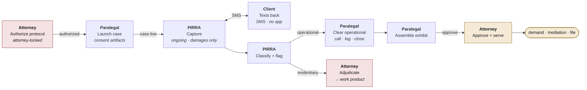
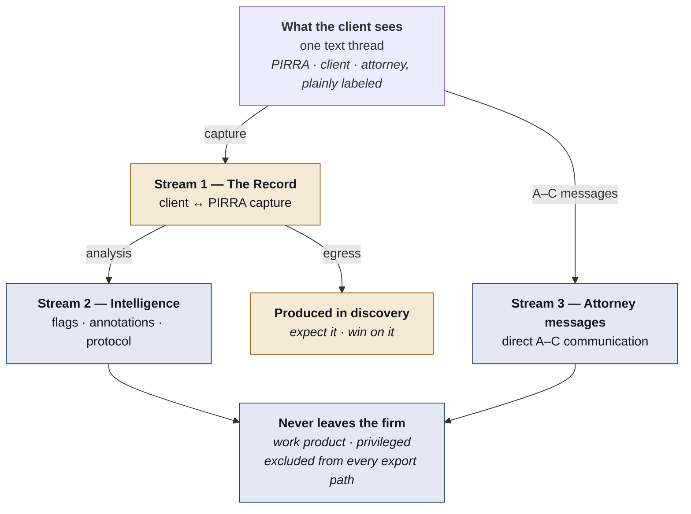
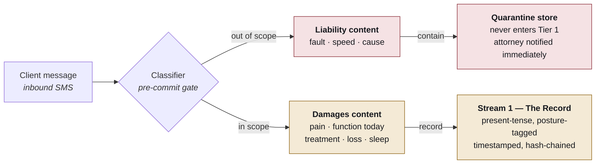

# PIRRA — System Map

**v0.1 · working architecture · August 2026**

Rendered version with full diagrams: [`system-map.html`](./system-map.html) · Decisions behind it: [`decisions/0001`](./decisions/0001-evidence-privilege-and-scope.md)

> **Spine:** attorney authorizes → PIRRA captures → paralegal runs → attorney adjudicates → exhibits out.
> One text thread for the client, three severable stores underneath, a hard boundary around what PIRRA may discuss.

---

## Actors

The negative column is doing legal work, not product-scoping work.

| Role | Does | **Cannot** |
|---|---|---|
| **Attorney** | Authorizes the conversation protocol at case open. Adjudicates evidentiary flags. Approves exhibits. Replies in-thread. | Delegate protocol authorization or evidentiary-flag disposition — both credential-locked. |
| **Paralegal** | Primary operator. Works the queue, clears operational flags, calls the client, assembles exhibits. | Dispose of an evidentiary flag, or send anything that reads as legal advice. |
| **PIRRA** | Texts on the firm's number. Captures present-condition statements. Classifies and flags. Always discloses it is an AI. | Discuss liability, advise, evaluate the case, or pursue an unauthorized topic. |
| **Client** | Texts back. No app, no login. Sees one thread, three labeled speakers. | Delete messages once under representation — archival only. |

---

## 1. Lifecycle — where each role touches the case

The attorney appears at exactly two points. Everything between is the paralegal's. That is what keeps *attorney-directed* true without making it expensive.

---

## 2. Storage — one thread the client sees, three stores that must come apart

This is the architectural claim the whole legal position rests on. The client experiences a single continuous thread; underneath, messages land in three stores with three discovery postures, and exactly one has a path out of the building.

Stream 2 is generated *from* Stream 1 by analysis — the client never sees it and never writes to it. It is also the only store whose disclosure would actively damage the client, which is why work-product protection concentrates here rather than on the capture layer.

**If these ever share a table with a visibility flag, one bad export destroys the work-product claim for that firm.** Severability is the schema, not a later feature.

---

## 3. The liability boundary

PIRRA talks about damages. It does not talk about how the injury happened, who was at fault, how fast anyone was going, or what anyone admitted at the scene.

**Classification happens before the write, not after it.** The log is immutable, so a liability
statement that lands in Tier 1 can never be removed — deletion is spoliation, and deleting inside
a tamper-evident chain makes the deletion provable. So the classifier is a real-time gate on the
write path: liability content routes to a quarantine store and **never enters Tier 1 at all**,
which means producing the record does not produce the admission. Quarantine is routing, not
deletion — the message stays immutable and hash-chained, just outside the stream with an egress
path. See [DR-0002 D8](./decisions/0002-containment-cms-firewall-and-pilot-metrics.md).

False negatives are unrecoverable; false positives are cheap and attorney-reversible. **Tune
aggressively toward over-quarantine.**

The prompt library carries the other half: *PIRRA never opens with, or returns to, how the injury
happened.* That is the most natural rapport move in human conversation and it must be designed
out of the protocol entirely.

Voice is the highest-risk channel here — an SMS turn has a gate between messages; a live call
does not, and likely needs summarize-and-quarantine by default.

---

## 4. Flag authority

The split is not about seniority. An operational flag asks someone to make a phone call; an evidentiary flag asks someone to make a judgment about the case.

| Flag | Trigger | Disposition | Why |
|---|---|---|---|
| Missed appointment | gap in treatment cadence | **Paralegal** | Call, log, close. |
| Client gone quiet | non-response window | **Paralegal** | Neutral status code — silence never reads as recovery. |
| New symptom | unreported complaint | **Paralegal** | Escalates if it suggests a new injury claim. |
| Account inconsistency | statement conflicts with record | **Attorney** | Credibility judgment. Paralegal dismissal is a Rule 5.3 problem. |
| Adverse statement | content damaging to the claim | **Attorney** | Requires case strategy, not a callback. |
| Liability volunteered | causation content detected | **Attorney** | Immediate. Quarantined, undeletable, in a produce-expected stream. |

**Tamper-evidence cuts both ways.** An unacknowledged flag sitting 60 days inside a hash-chained, independently timestamped record is proof the firm was on notice and did nothing. Needs an acknowledgment SLA, escalation on lapse, and a retention decision with outside counsel before the pilot.

---

## 5. Build target — the paralegal workbench

Five surfaces. The attorney gets the same application with two extra permissions and a digest — not a separate product, and not a separate login to forget about.

1. **Queue** — every active case sorted by what needs attention. Unacknowledged flags, then quiet clients, then healthy. Open all day.
2. **Case view** — timeline from the client's own words, each entry tagged by hearsay posture, clicking through to the exact message. Flags in a rail. Attorney-only flags visible but locked.
3. **Thread** — full conversation, three speakers labeled. Paralegal sends as themselves; requesting an attorney reply is a distinct action.
4. **Flag disposition** — acknowledge, act, note. Evidentiary flags read-only for the paralegal, with a visible SLA clock, because the clock is a legal artifact.
5. **Exhibit builder** — demand-packet exhibit, recovery-curve chart, depo-prep log, prior-consistent-statement packet. Every figure carries its source reference. Draws structurally from Stream 1 only. Attorney approval gates export.

---

---

## 6. CMS sync — the zero-endpoint firewall

| Direction | Contents |
|---|---|
| **Pushed to CMS** | Finalized Stream 1 exhibit PDFs. Administrative milestones only (`check-in completed`, `exhibit generated`). |
| **Never leaves PIRRA** | All Stream 2 — flags, alerts, annotations, protocol, alert history. |

The connector must **physically lack a Stream 2 endpoint** — absent, not disabled, not
permission-gated. The failure mode is not an unauthorized user; it is a conscientious paralegal
copying a flag into a Clio note because that is where case notes go. Defend against diligence,
not malice.

`check-in completed` is safe to sync. `flag raised` is not — the existence and timing of a flag is
itself work product, and a CMS timeline of flag events reconstructs Stream 2 from metadata alone.

Targets: Clio, Filevine, SmartAdvocate.

---

## Still open

- **Case closure** — retention, export to the firm file, the client's copy, the billing event.
- **Proving attorney presence** — minimum touch cadence, and how we evidence it.
- **Quarantine posture** — whether the quarantine store is itself protected. Needs counsel before the pilot.
- **Unit economics under load** — `$149` flat assumes light usage; model the deeply-engaged client and voice transcription.
- **Disbursement pass-through** — case cost vs. overhead is a state-rules question, not a positioning choice.
- **Rule 1.4 expectations** — response-time expectations set explicitly at onboarding.

---

*Not legal advice. Architecture and contracts subject to review by outside counsel per jurisdiction.*
